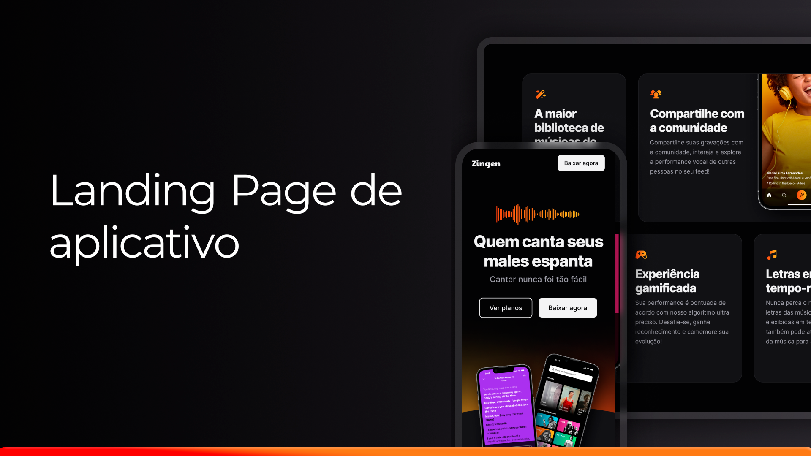

# 🎤 Landing Page de Aplicativo - Zingen

<p align="center">
  
</p>

<div align="center">

[](#-tecnologias)
[](#-projeto)
[](#memo-licença)

</div>

---

## ✨ Sobre o Projeto

Bem-vindo à Landing Page do **Zingen**, um aplicativo de karaokê que transforma qualquer momento em diversão! 🎶

- **Objetivo:** Criar uma página de marketing **totalmente responsiva** e moderna.
- **Aprendizados:** Técnicas de **CSS avançado**, foco em **responsividade** e design.

<br/>

## 🚀 Tecnologias

Este projeto foi desenvolvido com as seguintes tecnologias:

- **HTML5**
- **CSS3**

---

## 🎯 Objetivos do Projeto

🔹 Construir uma página com **design clean** e **layout responsivo**.  
🔹 Utilizar **CSS moderno**, com transições e efeitos visuais dinâmicos.  
🔹 Implementar práticas de **acessibilidade** e otimização para dispositivos móveis.

---

## 📸 Preview do Projeto

<div align="center">
  
</div>

---

## 🔗 Links Úteis

- [Acesse o site ao vivo](#)  
- [Tutorial de Desenvolvimento](#)  
- [Outros projetos da Rocketseat](https://rocketseat.com.br)

---

## 🛠 Como Executar o Projeto

1. **Clone o repositório:**  
   ```bash
   git clone https://github.com/seu-usuario/repo-zingen.git
